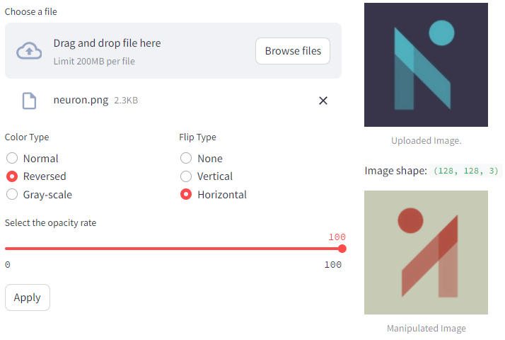
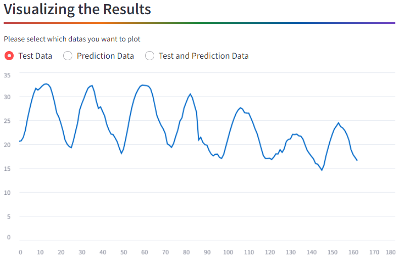

"""
# Streamlit Image Processing and LSTM Training Demo

Original repo: https://github.com/girunlu/neuron.ai-projects.git

This Streamlit demo combines functionalities for image manipulation and LSTM training with tabular data.



## Image Processing
The **Image Processing** tab allows users to upload an image and apply various manipulations using sliders.

### Interface
- Users can choose an image file using the file uploader.
- Manipulations include color adjustments, flipping, and opacity control.
- The original and manipulated images are displayed side by side.

```python
# Example Usage
import streamlit as st
import numpy as np
import cv2

uploaded_file = st.file_uploader("Choose a file")
if uploaded_file is not None:
    img = np.frombuffer(uploaded_file.read(), dtype=np.uint8)
    img = cv2.imdecode(img, cv2.IMREAD_COLOR)
    img = cv2.cvtColor(img, cv2.COLOR_BGR2RGB)
    # ... (manipulation logic)
    st.image(img, caption='Uploaded Image.', use_column_width=False, width=175)
    st.image(new_image, "Manipulated Image", use_column_width=False, width=175)
```

# Training LSTM with Tabular Data

The **Training LSTM with Tabular Data** tab focuses on training an LSTM model with tabular data.



## Interface
- Displays a temperature log in Celsius degrees over a specific time range.
- Users can start the training process with a button click.
- Data preprocessing, training, and prediction isolation are displayed with loading spinners.
- Visualizes the training data and provides options to plot test data, prediction data, or both.

```python
# Example Usage
import streamlit as st
import pandas as pd
import time

df = pd.read_csv("./formatted.csv")
st.dataframe(df, use_container_width=True)

if st.button("Start Training"):
    with st.spinner('Data is preprocessing...'):
        time.sleep(1.3)
    with st.spinner('Training...'):
        time.sleep(2.2)
    with st.spinner('Isolating the Predictions...'):
        time.sleep(1.2)
    st.success('Done!', icon="✅")

st.line_chart(d1, use_container_width=True)

plot = st.radio(
    "Please select which datas you want to plot",
    ["Test Data", "Prediction Data", "Test and Prediction Data"], index=0, horizontal=True)
# ... (plotting logic)
st.line_chart(ddf)
```

# Acknowledgment

Thank you for participating in this demo! For more information and to stay up-to-date with our events, visit [Neuron AI](https://neuron-ai.at/).

*Note: The chatbot section has been commented out due to potential issues with Streamlit regulations. If needed, please uncomment and provide additional context.*

